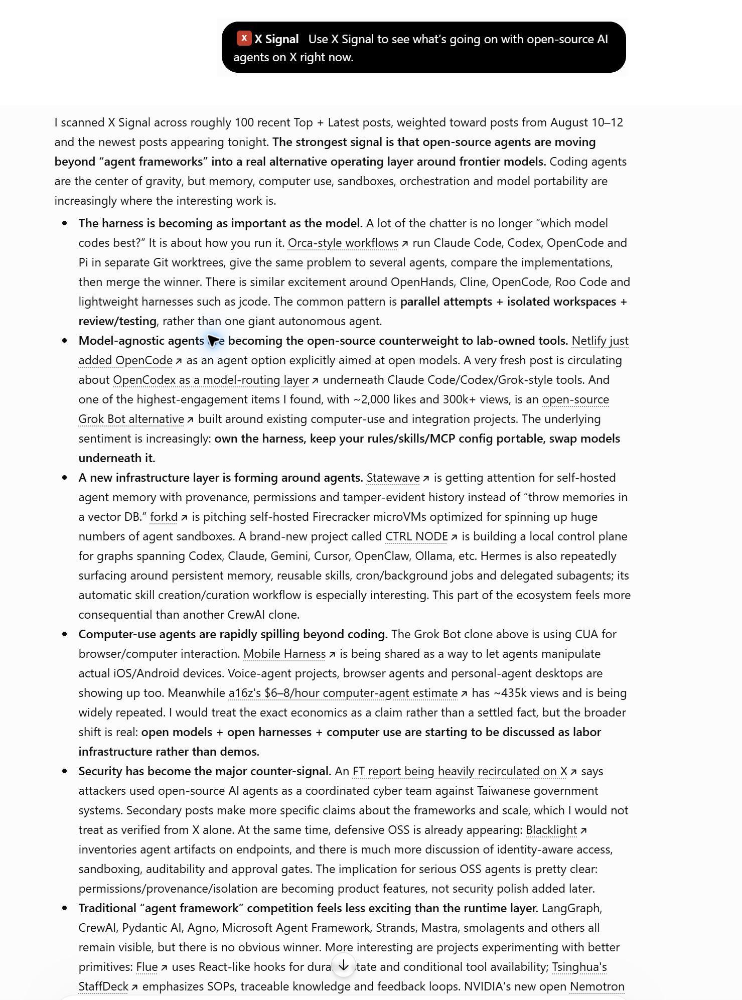
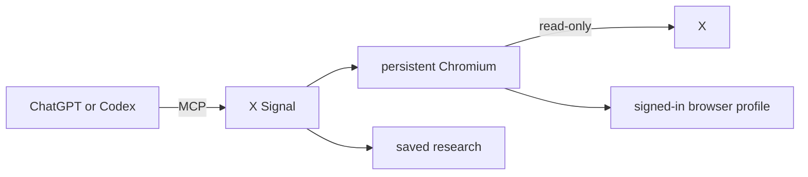

# X Signal — X (Twitter) research for ChatGPT and Codex

[](https://github.com/anotb/x-signal/actions/workflows/ci.yml) [](LICENSE)

X Signal lets ChatGPT or Codex research X through an account you already use. Ask a normal question and it can search Top and Latest, follow threads, compare feeds, find accounts, and link the posts behind its answer.

The X Signal service, browser, and saved research run on your computer in Docker. Your X session is stored in a persistent browser profile. X Signal is read-only: it does not post, like, follow, or send messages. Local use needs no OpenAI or X API key. ChatGPT web uses OpenAI's optional Secure MCP Tunnel transport, described below.

> Use X Signal to research what developers are saying about local voice agents this week. Check Top and Latest, follow useful threads, and link the posts that matter.

[Install](#install) · [Connect ChatGPT or Codex](#connect-chatgpt-or-codex) · [See it work](#see-it-work) · [How it works](#how-it-works)

## What it can research

- Run several Top, Latest, or Media searches together, with date, language, account, engagement, and content filters.
- Read exact Following, For You, bookmarks, user, list, and community timelines.
- Open a post, reconstruct the author thread, and separate replies from quote posts.
- Find people and organizations, then read their timelines.
- Let long searches keep running, review the saved results, and dig further into the useful parts.
- Monitor a topic or feed over time and export results as Markdown, CSV, JSON, or NDJSON.

The model chooses how broadly to search and uses direct references when they help the answer.

## Install

You need:

- Docker with Compose. Docker Desktop is the usual choice on Windows and macOS; use Linux containers on Windows.
- An X account.
- Chrome only if you want automatic session sync from a dedicated Chrome profile.
- Node.js 24.19 or newer only for ChatGPT tunnel setup, tests, MCP Inspector, backup/restore, or stdio.

Clone the repository and open its folder:

```bash
git clone https://github.com/anotb/x-signal.git
cd x-signal
```

You can also [download the latest source as a ZIP](https://github.com/anotb/x-signal/archive/refs/heads/main.zip).

### Let a coding agent set it up

If Codex or another coding agent can use your terminal, give it this:

> Set up X Signal from this repository on my computer. Detect my operating system and check the prerequisites first. Keep every service on the default loopback ports. Start the Docker Compose stack, wait for it to become healthy, and verify `/healthz` and `/readyz`. Connect my local Codex client to `http://127.0.0.1:7345/mcp`. Never ask me to paste cookies, session tokens, API keys, or passwords into chat. For X sign-in, guide me through either the session companion in a dedicated Chrome profile or the local noVNC browser. Do not bypass an X challenge. If I ask for ChatGPT web support, use the repository's `chatgpt` Secure MCP Tunnel profile and have me enter its tunnel ID and restricted runtime key directly into the hidden local setup prompt. Never expose port 7345 or put a credential in shell output. Tell me when a visible step needs me.

The repository also includes [instructions for coding agents](AGENTS.md).

### Windows

```powershell
Copy-Item .env.example .env
docker compose up -d --build --wait
Invoke-RestMethod http://127.0.0.1:7345/readyz
```

### macOS or Linux

```bash
cp .env.example .env
docker compose up -d --build --wait
curl -fsS http://127.0.0.1:7345/readyz
```

Both services should show `healthy` in `docker compose ps`.

## Sign in to X

### Recommended: use a dedicated Chrome profile

This keeps your research account separate from the X account you use every day.

1. Create a Chrome profile and sign in to the X account you want X Signal to use.
2. Open `chrome://extensions`, turn on **Developer mode**, and choose **Load unpacked**.
3. Select `extensions/x-signal-session-companion` from this repository.
4. Open the extension, give the profile a recognizable name, leave automatic sync on, and click **Use this profile** once.

The session refreshes when that Chrome profile starts, every five minutes while it is open, and when its X cookies change. Docker keeps its own signed-in copy between refreshes and across restarts. Other Chrome profiles cannot silently replace the selected account.

See the [session companion guide](extensions/x-signal-session-companion/README.md) for switching accounts and one-time transfers.

### Or sign in inside Docker

Open [the local browser](http://127.0.0.1:6080/vnc.html?autoconnect=1&resize=scale) and sign in to X once. Copy the generated VNC password to your clipboard:

```powershell
# Windows
docker compose exec -T browser sh -lc 'cat /data/.vnc/password.txt' | Set-Clipboard
```

```bash
# macOS
docker compose exec -T browser sh -lc 'cat /data/.vnc/password.txt' | pbcopy
```

On Linux, pipe the same command to your desktop clipboard tool: `wl-copy` on Wayland or `xclip -selection clipboard` on X11.

The browser profile stays in the `xsignal_browser` Docker volume.

## Connect ChatGPT or Codex

### Codex

In the Codex desktop app or IDE extension, open **Settings → MCP servers**, add a **Streamable HTTP** server, and use:

```text
http://127.0.0.1:7345/mcp
```

Or add this to `~/.codex/config.toml`:

```toml
[mcp_servers.x-signal]
url = "http://127.0.0.1:7345/mcp"
tool_timeout_sec = 900
```

Restart the client after saving. The longer host timeout is for deep feed reads; broad searches use durable jobs and can be polled without starting over. Codex’s [MCP documentation](https://learn.chatgpt.com/docs/extend/mcp) covers the shared desktop, CLI, and IDE configuration.

The repository is also a local Codex plugin with four optional skills. The plugin bundles the same MCP connection, so install it instead of adding the server twice. See [client setup](docs/CLIENTS.md).

### ChatGPT web

ChatGPT cannot reach localhost directly. X Signal includes OpenAI's **Secure MCP Tunnel** as an optional, supervised Compose service. It keeps the MCP server private, gives the connection a stable identity, and reconnects after Docker or machine restarts.

1. In [Platform tunnel settings](https://platform.openai.com/settings/organization/tunnels), create a tunnel and associate the ChatGPT workspace that will use it.
2. Create a dedicated [runtime API key](https://platform.openai.com/settings/organization/api-keys). Under **Restricted**, give only **Tunnels → Read, Use**.
3. Run the local setup command and enter the tunnel ID and key when prompted. Key input is hidden; both values are saved only in ignored local files.

```bash
npm run tunnel:secure:configure
docker compose --profile chatgpt up -d --build --wait
```

4. In ChatGPT, open **Settings → Security and login** and turn on **Developer mode**.
5. Open **Plugins**, select the plus button, and create an app named **X Signal**.
6. Choose **Tunnel**, select the tunnel, review the discovered tools, and create the app.
7. Add X Signal from the tools menu in a new chat.

The runtime key authenticates the private tunnel transport only. X Signal does not call OpenAI models with it, and local Codex use still needs no OpenAI key. The tunnel stays available while Docker is running; `docker compose --profile chatgpt ps` and [its local readiness page](http://127.0.0.1:7346/readyz) show its state.

Developer Mode and tunnel access depend on account and workspace policy. See OpenAI's [Secure MCP Tunnel guide](https://developers.openai.com/api/docs/guides/secure-mcp-tunnels) and the detailed [client setup](docs/CLIENTS.md).

## See it work

This is a real ChatGPT answer from a live X Signal search. The request was deliberately simple; ChatGPT chose a broad Top + Latest scan, synthesized roughly 100 recent posts, and linked the evidence that helped.

> Use X Signal to see what’s going on with open-source AI agents on X right now.



The capture shows public search results only and was reviewed to exclude account, session, and private-feed data. See [live examples](docs/EXAMPLES.md) for a second, different research task.

## Prompts to try

- “What is happening with this company on X today? Check multiple angles and tell me what is confirmed, disputed, or just being repeated.”
- “Compare how developers are discussing these two products over the last seven days. Separate first-party announcements from hands-on reports.”
- “Find the important accounts around this topic, then research the claims they disagree about.”
- “Read my exact Following feed from this morning, keep useful replies, and open the threads behind the five items worth my time.”
- “Read this post, reconstruct the author’s thread, and separate supportive replies from quote-post counterarguments.”
- “Create a daily monitor for this topic and export the latest change as Markdown.”

## How it works



The default Compose stack has two services: a small Node/SQLite app and an interactive Chromium sidecar. The optional `chatgpt` profile adds OpenAI's pinned tunnel client. Searches use one persistent browser with bounded concurrency, request spacing, caching, and adaptive backoff. Stored jobs, evidence, and the browser profile survive restarts.

## Privacy and limits

The app, browser debugger, and noVNC bind to localhost by default. Browser volumes and backups contain reusable sign-in state, so treat them like passwords. Normalized results are sent to the ChatGPT, Codex, or MCP client you choose when it calls a tool. X challenges require visible sign-in through the local browser; X Signal does not bypass them.

X Signal is an independent research tool for accounts you control. It is not affiliated with X or OpenAI and is not intended to bypass X’s API, authentication, access controls, challenges, rate limits, or other safeguards. Use it only with content your account may access and follow X’s terms.

## Project docs

- [Client setup](docs/CLIENTS.md)
- [Operations and backups](docs/OPERATIONS.md)
- [Troubleshooting](docs/TROUBLESHOOTING.md)
- [Architecture](docs/ARCHITECTURE.md)
- [Security](SECURITY.md)
- [Contributing](CONTRIBUTING.md)

X Signal is available under the [MIT License](LICENSE).
