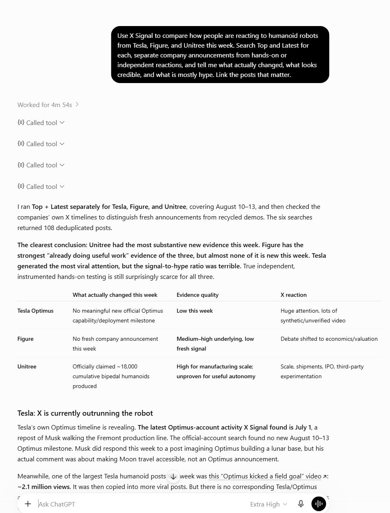

# Live examples

These are real ChatGPT answers produced with X Signal against public X results. They are included as screenshots so the wording, links, and reference treatment are shown exactly as ChatGPT produced them. Tool activity is collapsed or omitted; account, session, and private-feed data are not shown.

Live X results change, so running the same request later will produce a different answer.

## A broad single-topic scan

**Prompt**

> Use X Signal to see what’s going on with open-source AI agents on X right now.

ChatGPT decided how to search, scanned roughly 100 recent Top and Latest results, and used ordinary inline links where they supported the synthesis. The capture joins the exact prompt and response from the same conversation; only the intervening tool activity is omitted.

## A multi-company evidence comparison

**Prompt**

> Use X Signal to compare how people are reacting to humanoid robots from Tesla, Figure, and Unitree this week. Search Top and Latest for each, separate company announcements from hands-on or independent reactions, and tell me what actually changed, what looks credible, and what is mostly hype. Link the posts that matter.

This run made eight X Signal calls. It searched Top and Latest for each company, checked company timelines, deduplicated 108 posts, then compared fresh evidence with recycled or synthetic clips. The capture shows the opening of the completed answer.

